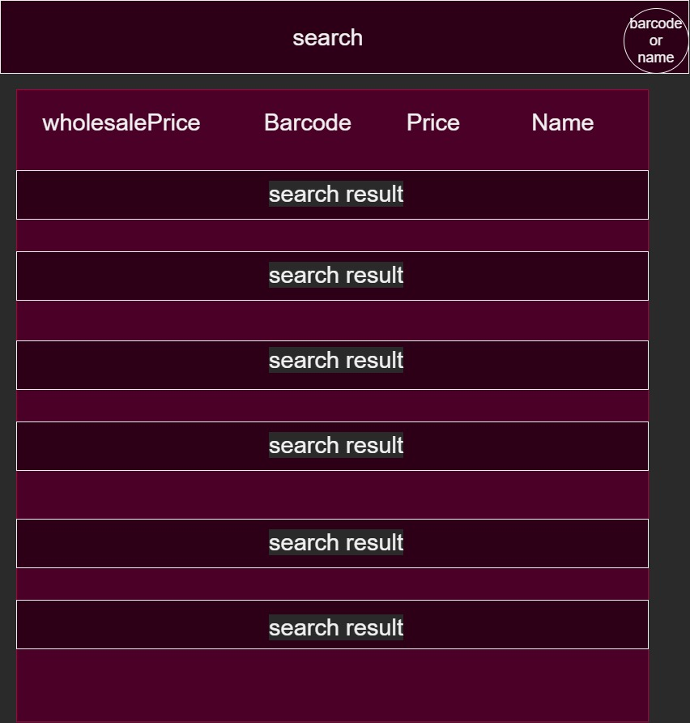
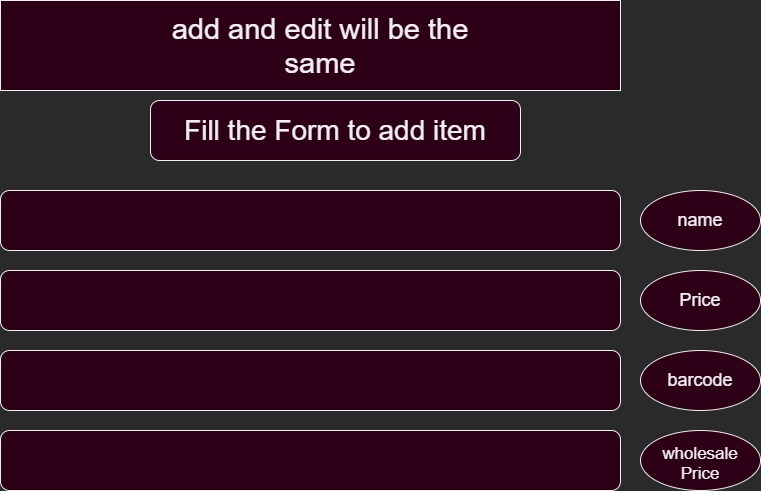
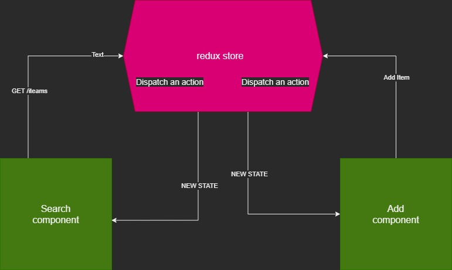

# This is an Front end for small Janaa detergent sales shop data

Hi there this is a small project about a my friend Janaa's shop.
he asked to make a POS system for her shop.
But I I am a web developer so i decided to make a web application for the shop.

- Its sole purpose to build a application using React typescript and redux

## the main goal of this project is to make a web application for the shop.

after that i will make a desktop version for the shop using ElectronJs but for starters.

### 10/14/2021 MVP

lets start with main page.

- In the main page will be search bar and a list of products.
- second page user can add products to the database. (maybe if i ever did make an ElectronJs version will be saved in the same folder).
- Edit will be same page as add but with a different button. and characteristics will be different.
- Delete will be modal window with a delete button.

---

#### main page

---

#### add and edit page

---

#### state flow: form two pages

